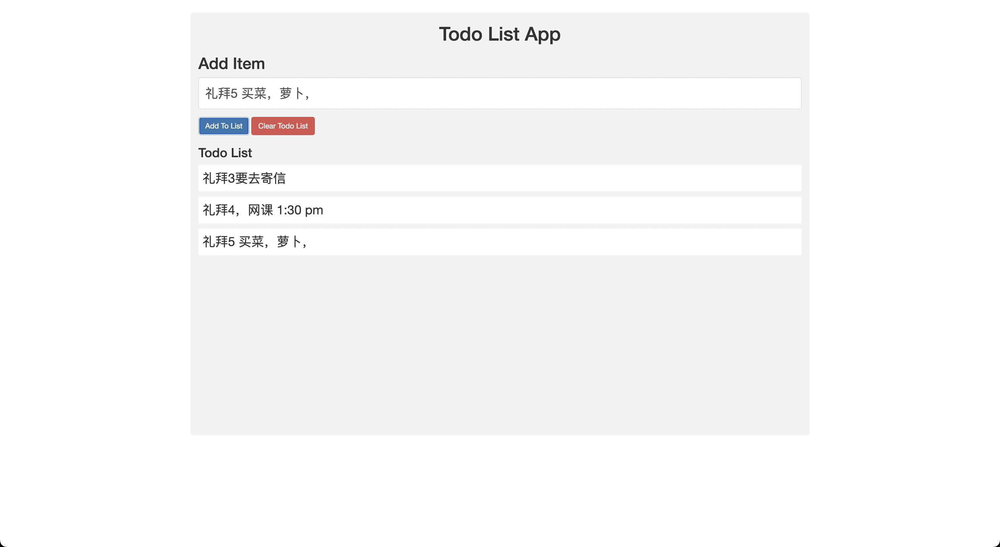

# Table of contents

- [Table of contents](#table-of-contents)
  - [Introduction ](#introduction-)
  - [Project 1 To do list ](#project-1-to-do-list-)
  - [Project 2 To do list Advance ](#project-2-to-do-list-advance-)
    - [Sub paragraph ](#sub-paragraph-)
  - [Another paragraph ](#another-paragraph-)

## Introduction 

基础 html css javascript 课程。

- 资源链接
  - https://www.w3schools.com/html/default.asp

## Project 1 To do list 

- html tags
  - h1 - h6, head, title, ul, button, form, input, p
- css box model
- Dom Events
- Get the element
  - document.getElmentById,
  - document.getElmentsByClassName
  - document.querySelector("p");

## Project 2 To do list Advance 

- json-server
- node js

### Sub paragraph 

## Another paragraph 
# web-dev-class
