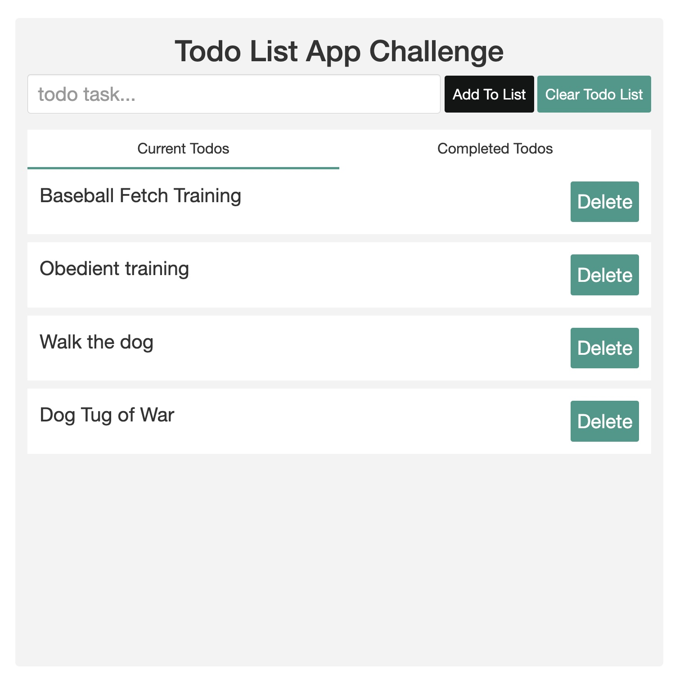

# Westminster Kennel Club Dog show, Owner preparation to do list challenge

You are responsible for managing the website for the Westminster Kennel Club Dog Show. These dog owners are _very_ competitive. We need to make sure that they can view their to do list to prep their dogs for the show.

This will serve your code on http://localhost:3000.

### Getting Started 1

## Challenge 1 - functional

- create two tab to show completed and current to dos
- when delete button is clicked on move that to do to completed
- Tab 1: <button> Current Todos </button>
- Tab 2: <button>Current Completed </button>

## Challenge 1 extended

- Same color
- Same style
- Same layout

## Challenge 2

### Getting Started 2

You will be using the [json-server](https://github.com/typicode/json-server) package to mock an external API. You can make the same RESTful requests to this server that you would to any API. If you haven't yet, install json-server.

- The dog should be put on the table as a table row. The HTML might look something like this `<li><p>Dog training</p> <button>Done<button><Button>Delete<Button><li>`
- Create two tabs one that show all todos, and one show current todos, when done is clicked on move todo item to done.

If node haven't been download, download here,
https://nodejs.org/en/download/

<p>Check version to see if properly install</p>

```bash
npm --version
node --version

```

<p> install json-server</p>

```bash
npm install -g json-server
```

Then run the server with:

```bash
json-server --watch db.json
```

### Deliverables

- On page load, render a list of already registered todos in the unordered list. You can fetch these dogs from http://localhost:3000/todos.



